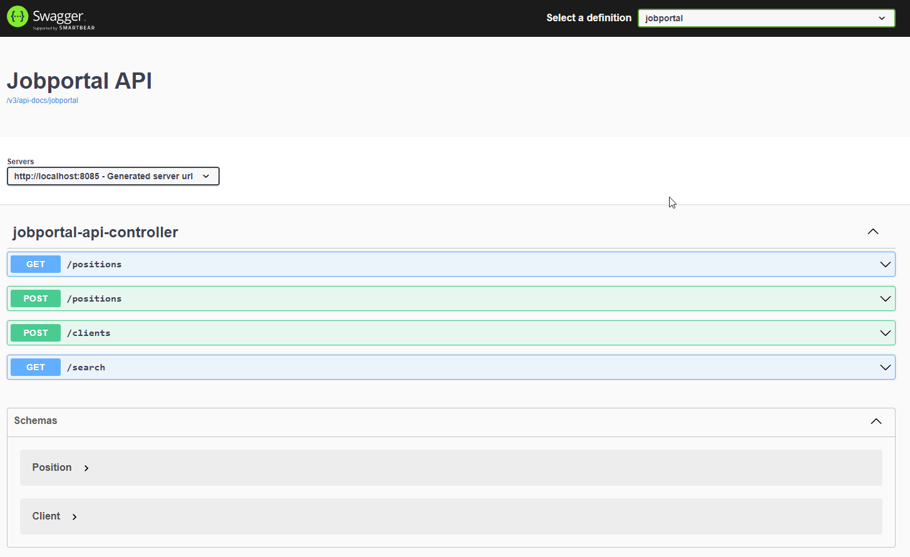

# Jobportal Demo Application in Java

Register client applications, post and search positions. Using in memory database and swagger-ui. 

## API definition



## Building and starting the application

### Pre-requisites
- JDK 11+
- maven 3
- gitbash

### Using spring-boot:run
We can build and start the application using the mvn wrapper and spring-boot:run

```sh
mvnw spring-boot:run
```

### Building executable JAR
To create executable jar ``target/jobportal-1.0.0.jar`` , simply run

```sh
mvn clean package
```
To start the application

```sh
java -jar target/jobportal-1.0.0.jar
```

To start the application on a different port use e.g. ``-Dserver.port=8083``

```sh
java -jar -Dserver.port=8083 target/jobportal-1.0.0.jar
```


## Sample commands
To check swagger-ui api docs open in a browser 

```sh
http://localhost:8085/swagger-ui/index.html
```
or use curl

```sh
curl -X GET http://localhost:8085/v3/api-docs/jobportal
```

To post and register a new client:

```sh
curl -X POST http://localhost:8085/clients -H 'Content-Type: application/x-www-form-urlencoded' -d 'name=Demo%20User&email=DemoUser%40demo.com'
```
To post and save a new position:

```sh
curl -X POST http://localhost:8085/positions -H 'Content-Type: application/x-www-form-urlencoded' -H 'api-key: 1babfc4d-5de7-4dbc-a882-3b24c773016c' -d 'name=Employee%20Manager&location=Paris'
```
To search positions

```sh
curl -X GET 'http://localhost:8085/search?keyword=queen&location=London' -H 'api-key: 1babfc4d-5de7-4dbc-a882-3b24c773016c'
```
## Future improvements
### Functional improvements
- Implement Post/Redirect/Get flow to avoid duplicated form submissions
- Enrich (position descriptions, tags, links) and extend datamodel (applicants and applications), use real database
- Use (for example) Keycloak and OpenID Connect for identity management and to secure the application

### Development and deployment
- Setup Jenkins for continuous development and integration
- Setup Sonar for static code analysis
- Setup and use docker images and cloud deployment of new builds/releases

### Maintenance and Operation
- Improved monitoring with opentelemetry and Datadog

